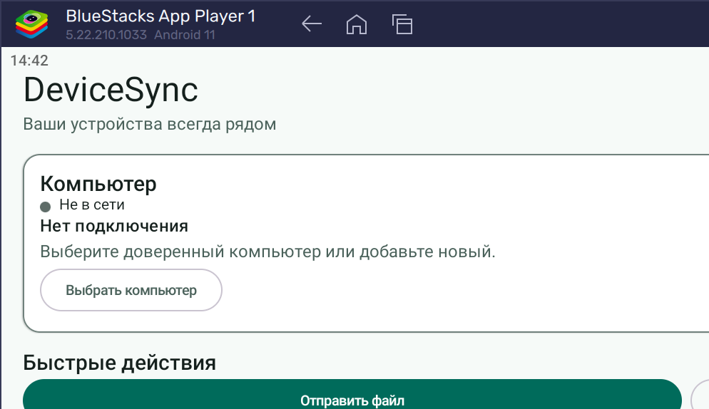
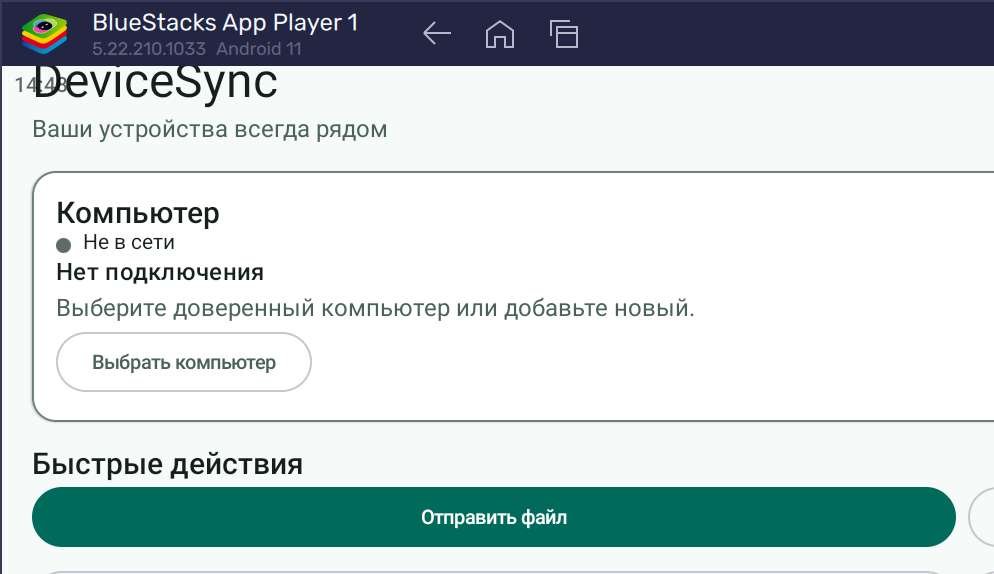

# DeviceSync для Android

[English](README.md) | [Русский](README.ru.md)

DeviceSync — Android-компаньон для компьютера с Windows. Приложение находит и безопасно сопрягается с настольной частью, после чего предоставляет локальную передачу файлов, общий буфер, пересылку уведомлений, доступ к файлам телефона, фоновое переподключение и необязательную клавиатуру DeviceSync.

<p align="center">
  
</p>

> DeviceSync активно развивается. Мощные разрешения нужны только отдельным функциям — изучите разделы [Разрешения Android](#разрешения-android) и [Текущие ограничения](#текущие-ограничения).

## Содержание

- [Возможности](#возможности)
- [Скриншоты](#скриншоты)
- [Требования](#требования)
- [Установка и запуск](#установка-и-запуск)
- [Сборка из исходного кода](#сборка-из-исходного-кода)
- [Сопряжение с Windows](#сопряжение-с-windows)
- [Основные сценарии](#основные-сценарии)
- [Архитектура](#архитектура)
- [Безопасность и конфиденциальность](#безопасность-и-конфиденциальность)
- [Разрешения Android](#разрешения-android)
- [Разработка и тестирование](#разработка-и-тестирование)
- [Решение проблем](#решение-проблем)
- [Текущие ограничения](#текущие-ограничения)
- [Участие в разработке и лицензирование](#участие-в-разработке-и-лицензирование)

## Возможности

Android-приложение — мобильная часть DeviceSync. Оно владеет соединением с доверенным Windows-компьютером и направляет согласованные сообщения протокола компонентам файлов, буфера, уведомлений, каталога и синхронизации.

Реализованные возможности:

- обнаружение через mDNS/DNS-SD и UDP-маяк, QR-сканирование и ручное подключение по IP;
- QR-сопряжение, постоянное доверие устройств, TLS SPKI pinning и подписанная аутентификация идентичности;
- переподключение через LAN, точку доступа и USB-модем с медленным Bluetooth RFCOMM fallback;
- двусторонняя потоковая передача файлов с SHA-256 и checkpoint для возобновления V2;
- ручная отправка текста и включаемая пользователем синхронизация буфера;
- пересылка Android-уведомлений после специального разрешения и настройки allowlist;
- каталог медиа и папок для Windows, ограниченный выданными разрешениями;
- очереди передач, foreground services и восстановление разрешённой фоновой работы после перезагрузки;
- экспериментальная синхронизация папок;
- необязательная модульная RU/EN-клавиатура DeviceSync с локальными подсказками, T9, emoji, буфером и режимами приватности;
- русские и английские ресурсы интерфейса.

Android и Windows согласуют версию протокола и capabilities. Неподдерживаемая функция остаётся выключенной.

## Скриншоты

<p align="center">
  
  
</p>

Сейчас в репозитории есть только снимки главного экрана. Для полной галереи нужны чистые скриншоты обнаружения, QR-сопряжения, передачи, буфера, уведомлений, разрешений, фоновых настроек, каталога телефона и подключения клавиатуры.

## Требования

| Сценарий | Требование |
|---|---|
| Запуск приложения | Android 8.0 или новее (`minSdk 26`) и совместимая Windows-часть DeviceSync |
| Подключение по LAN | Телефон и ПК в одной доступной частной сети |
| Сборка из исходников | Android SDK 36, JDK 17 или совместимый более новый JDK и включённый Gradle wrapper |
| Сканирование QR | Камера либо ручное подключение там, где оно подходит |
| Фоновая работа | Разрешение уведомлений на Android 13+, уведомление foreground service и настройки батареи, не приостанавливающие DeviceSync |
| Bluetooth fallback | Bluetooth и предварительное системное сопряжение Android с Windows |

Текущая конфигурация использует target/compile API 36 и JVM bytecode 17, Kotlin `2.2.10`, Android Gradle Plugin `8.13.0` и Gradle `9.4.1`.

## Установка и запуск

APK и AAB являются результатами сборки и исключены из Git. Установите доверенный APK владельца проекта, когда он доступен, либо соберите его локально.

Установка debug APK через ADB:

```powershell
adb install -r .\app\build\outputs\apk\debug\app-debug.apk
```

Application ID пока равен `com.example.devicesync`. Это идентификатор разработки, который следует заменить перед публикацией в магазине.

## Сборка из исходного кода

Откройте корень репозитория в Android Studio, выберите совместимый JDK (язык и bytecode проекта настроены на Java 17), дождитесь Gradle Sync, выберите конфигурацию `app` и запустите её на устройстве или эмуляторе API 26+.

Если Java недоступна в терминале, укажите в `JAVA_HOME` встроенную среду Android Studio. Типичный путь в Windows:

```powershell
$env:JAVA_HOME = 'C:\Program Files\Android\Android Studio\jbr'
```

Сборка из PowerShell:

```powershell
.\gradlew.bat :app:assembleDebug
```

Debug APK:

```text
app\build\outputs\apk\debug\app-debug.apk
```

Локальная Release-сборка:

```powershell
.\gradlew.bat :app:assembleRelease
```

Release APK:

```text
app\build\outputs\apk\release\app-release.apk
```

Для production-подписи используются переменные:

```text
DEVICESYNC_ANDROID_KEYSTORE
DEVICESYNC_ANDROID_STORE_PASSWORD
DEVICESYNC_ANDROID_KEY_ALIAS
DEVICESYNC_ANDROID_KEY_PASSWORD
```

Без них Release-задача использует debug-подпись и не является сборкой для распространения. Никогда не коммитьте keystore и секреты подписи.

## Сопряжение с Windows

1. Запустите DeviceSync на Windows и подключите устройства к одной частной сети.
2. В разделе Windows **Устройства** нажмите **Подключить телефон** — появится временный QR-код.
3. На Android выберите **Добавить компьютер** и разрешите камеру.
4. Отсканируйте QR, проверьте информацию и подтвердите сопряжение.
5. Доверенный компьютер сохраняется локально и может переподключаться без нового QR, пока его идентичность не изменилась.
6. Включайте фоновое подключение только если после закрытия Android-интерфейса нужны reconnect, уведомления или очереди.

Если multicast discovery недоступен, введите IPv4 вручную. Windows обычно слушает TCP `54321`.

## Основные сценарии

### Отправка и получение файлов

Используйте быстрое действие главного экрана или страницу устройства. Входящее предложение требует подтверждения, если явная политика доверия не разрешает автоматический приём. Данные передаются потоком, проверяются SHA-256 и завершаются только после валидации.

### Общий буфер

Включите передачу буфера в настройках и для выбранного доверенного компьютера. Ручная отправка — более безопасный режим по умолчанию. Автоматический режим включается отдельно, подавляет циклы и не отправляет пустые или распознанные приватные контексты.

### Пересылка уведомлений

Откройте настройки уведомлений, выдайте специальный Notification Listener access и выберите приложения. Только разрешённые пакеты пересылаются в аутентифицированную Windows-сессию. Доступ можно отозвать в системных настройках Android.

### Доступ Windows к файлам телефона

Каталог может показывать разрешённые медиа, `Download`/`Documents` после явной выдачи all-files access и дополнительные папки из системного выбора документов. Доступ отзывается в настройках DeviceSync.

### Фоновое подключение

Включите фоновое соединение. Android покажет постоянное уведомление foreground service. Некоторые производители всё равно приостанавливают приложения; используйте **Разрешить работу без ограничений батареи** только при необходимости.

### Клавиатура DeviceSync

Откройте onboarding клавиатуры, включите её в системных настройках способов ввода и выберите активной. Словари и подсказки работают локально. В sensitive/incognito-полях отключаются подсказки, история буфера и обучение.

## Архитектура

```text
app/                 Compose UI, граф зависимостей, протокол, безопасность и функции
keyboard-engine/     Состояние, раскладки и движок подсказок без Android UI
keyboard-ime/        Android InputMethodService и UI клавиатуры
docs/                Архитектура, приватность, тестирование и медиакаталог
third_party/         Лицензии и атрибуция словарей
```

| Область | Ответственность |
|---|---|
| `core/network` | Единый владелец сессии, TLS, reconnect, транспорты и маршрутизация capabilities |
| `core/security` | QR, pairing, Android Keystore и записи доверенных устройств |
| `core/transfer` | Входящие/исходящие файлы, очереди, checkpoints и история |
| `core/sharing` | Буфер обмена и текст |
| `core/notifications` | Notification Listener, allowlist, payload и пересылка |
| `core/catalog` | Каталог медиа/папок и миниатюры в рамках разрешений |
| `core/background` | Foreground services, обработка перезагрузки и фоновая политика |
| `feature/*` | Compose-экраны и ViewModel |

`ConnectionManager` — единственный reader обычной сессии. Feature-менеджеры получают маршрутизированные сообщения и не конкурируют за InputStream. Фрейм состоит из четырёхбайтовой длины big-endian и UTF-8 JSON, совместимого с Windows.

## Безопасность и конфиденциальность

- LAN-соединение использует TLS и требует SPKI fingerprint Windows, полученный при сопряжении.
- Долгоживущий закрытый ключ Android хранится в Android Keystore.
- Подписанный challenge/response связывает reconnect с доверенной DeviceSync-идентичностью.
- Доверенные устройства, очереди и processed-message state хранятся локально через Room/DataStore.
- Для прямой синхронизации не требуется облачная учётная запись.
- Передача файлов проверяет metadata, offsets, размер, временное состояние и SHA-256.
- Пересылка уведомлений и автоматический буфер выключены до явного включения.
- Клавиатура не отправляет набираемый текст для подсказок; локальная история буфера зашифрована AES-GCM ключом Android Keystore.
- Диагностика должна скрывать секреты, содержимое и личные пути перед экспортом.

Никакое разрешение не заменяет доверие: сопрягайте только свой ПК, проверяйте каждую функцию и отзывайте больше не используемые устройства.

## Разрешения Android

Manifest объявляет разрешения для необязательных функций. Runtime или special access запрашивается в соответствующем сценарии.

| Разрешение или специальный доступ | Назначение |
|---|---|
| `INTERNET`, `ACCESS_NETWORK_STATE` | Локальное TCP/TLS-соединение и контроль состояния сети |
| `CHANGE_NETWORK_STATE`, `CHANGE_WIFI_STATE` | Поддержка сетевого соединения и discovery |
| `CAMERA` | Сканирование Windows QR-кода |
| `POST_NOTIFICATIONS` | Уведомления foreground services на Android 13+ |
| `FOREGROUND_SERVICE`, `FOREGROUND_SERVICE_CONNECTED_DEVICE`, `FOREGROUND_SERVICE_DATA_SYNC` | Разрешённое фоновое соединение и активные передачи по правилам Android |
| `WAKE_LOCK` | Завершение включённой пользователем работы соединения и передачи |
| `RECEIVE_BOOT_COMPLETED` | Восстановление допустимого фонового поведения после перезагрузки, обновления или unlock |
| `REQUEST_IGNORE_BATTERY_OPTIMIZATIONS` | Открытие системного экрана снятия ограничений по запросу пользователя |
| `BLUETOOTH*` / Nearby devices | Поиск уже сопряжённых Bluetooth-устройств и RFCOMM fallback |
| `READ_MEDIA_IMAGES`, `READ_MEDIA_VIDEO`, `READ_MEDIA_AUDIO` | Разрешённые медиа современного Android для каталога телефона |
| `READ_EXTERNAL_STORAGE` | Старый доступ к медиа до Android 13 |
| `READ_MEDIA_VISUAL_USER_SELECTED` | Только выбранные пользователем фото/видео там, где поддерживается |
| `MANAGE_EXTERNAL_STORAGE` | Необязательный полный доступ к `Download` и `Documents`; не нужен, если достаточно выбранных папок |
| Notification Listener access | Чтение уведомлений разрешённых приложений для отправки в Windows |
| Включение Input Method Service | Выбор клавиатуры DeviceSync через системные настройки |
| `VIBRATE` | Тактильная отдача клавиатуры и локальных действий |

`MANAGE_EXTERNAL_STORAGE`, Notification Listener, снятие ограничений батареи и включение клавиатуры — чувствительные решения. Не выдавайте их, если функция не используется.

## Разработка и тестирование

Запуск JVM-тестов, lint и сборки:

```powershell
.\gradlew.bat :keyboard-engine:test `
  :keyboard-ime:testDebugUnitTest `
  :app:testDebugUnitTest `
  :app:lintDebug `
  :app:assembleDebug
```

Инструментальные тесты на подключённом устройстве или эмуляторе:

```powershell
.\gradlew.bat :app:connectedDebugAndroidTest
```

Изменения протокола должны сопровождаться Windows-тестами и общими vectors. Для клавиатуры учитывайте [manual test matrix](docs/KEYBOARD_MANUAL_TEST_MATRIX.md), [privacy model](docs/KEYBOARD_PRIVACY.md) и требования атрибуции.

## Решение проблем

### Компьютер не находится

Проверьте общую LAN и отсутствие client isolation. Временно отключите VPN, меняющий локальные маршруты. Если multicast DNS заблокирован, используйте ручной IP.

### Истекает время подключения

Сначала запустите Windows-приложение, разрешите его в Windows Firewall для частной сети и проверьте TCP `54321`. Не отключайте брандмауэр целиком.

### Не работает QR-сопряжение

Разрешите камеру, при необходимости увеличьте яркость Windows-экрана и создайте новый QR. Если Windows-идентичность была пересоздана, удалите старые записи доверия на обеих сторонах.

### После закрытия приложения нет reconnect

Включите фоновое соединение, разрешите уведомления DeviceSync и проверьте батарею. OEM task killers могут нарушать даже стандартную работу foreground service.

### Не пересылаются уведомления

Выдайте Notification Listener access, включите функцию DeviceSync и добавьте пакет приложения в allowlist. Убедитесь, что Windows согласовал `notifications-v1`.

### Windows не видит файлы телефона

Разрешите только нужные категории медиа или папки. Для полного просмотра `Download`/`Documents` может потребоваться all-files access. После изменения разрешений откройте каталог заново.

## Текущие ограничения

- Package/application ID пока равен `com.example.devicesync` и не готов для магазина.
- APK/AAB не коммитятся, официальный публичный канал распространения в репозитории не описан.
- Политики батареи производителя могут прерывать reconnect даже с foreground service.
- Bluetooth — намеренно медленный fallback для буфера, команд и небольших файлов; крупные передачи должны идти по Wi-Fi, hotspot или USB tethering.
- Синхронизация папок, альтернативные транспорты, клавиатура и часть automation policies требуют более широкой проверки на реальных устройствах.
- Текущий набор скриншотов показывает только главный экран.

## Участие в разработке и лицензирование

Перед отправкой изменения:

1. не добавляйте в Git `build`, `.gradle`, APK, AAB, keystore и `local.properties`;
2. добавляйте тесты для изменения поведения и разрешений;
3. при wire-изменениях обновляйте обе платформы и test vectors;
4. запускайте тесты и lint;
5. описывайте влияние на безопасность, батарею, миграцию и приватность.

В корне пока нет `LICENSE`, поэтому общая лицензия на повторное использование не указана. Перед распространением или использованием кода получите разрешение владельца. Атрибуция клавиатуры и словарей описана в [KEYBOARD_THIRD_PARTY_NOTICES.md](docs/KEYBOARD_THIRD_PARTY_NOTICES.md) и каталоге `third_party/`.

Связанный Windows-репозиторий: [Lyrathorne/Windows-sync-app](https://github.com/Lyrathorne/Windows-sync-app).
